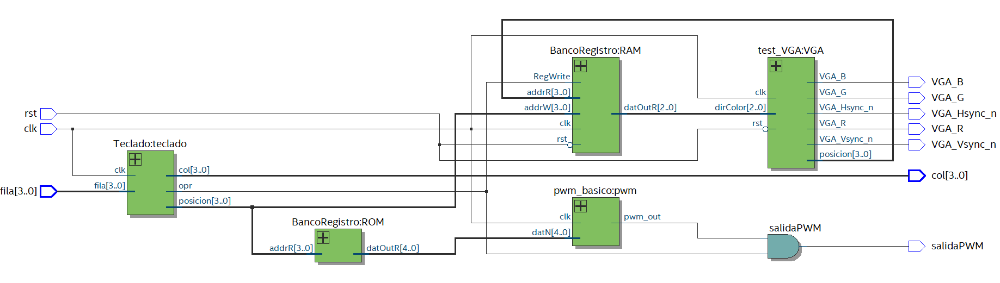

# Electrónica Digital 2021-1, Universidad Nacional de Colombia 
## Proyecto de Curso: Drumpad con visualización VGA
#### Nombres:
-Andrés Holguín Restrepo

-Julián Andrés Caipa Prieto

-Nicolás Velasquez

## Introducción

Un Drumpad es un dispositivo que permite la reproudcción de sonidos
previamente almacenados y asignados a algún controlador con posibilidad
de pulsación o interacción, como un teclado o algún sistema digital. El
drumpad interactúa con los toques dados externamente y reproduce el
sonido asignado a la casilla dada o botón. Este dispositivo es de amplio
uso en la industria de la música y el entretenimiento ya que permite el
control de sonidos almacenados y la reproducción de los mismos sin la
necesidad de generarlos nuevamente, algo conocido como *Sample*, y
permite hacer de ellos algo mas sencillo de controlar.

La idea del presente proyecto es la implementación de un drumpad que se
pueda controlar a través de un teclado matricial de 16 botones, y el
cual genere diferentes sonidos mediante el uso del sistema ”PWM” o Pulse
Width Modulation (Modulación de ancho de pulsos), y que permita la
visualización del botón pulsado del teclado mediante una pantalla VGA,
la cual alterna de color con cada que se pulsa el botón, extrayendo
dichos colores desde almacenamiento en memoria utilizando bancos de
registro. Adicionalmente, se genera la implementación utilizando los
conceptos de electrónica digital y el uso aplicado de tarjetas FPGA para
el desarrollo de proyectos programables con lógica.

## Objetivos

1.  Emplear los conocimientos de electrónica digital al desarrollo de
    proyectos que utilicen el control de señales digitales.

2.  Implementar proyectos con el uso de tarjetas tipo FPGA para el
    control programado de lógica y señales digitales.

3.  Aplicar los conceptos de lógica combinacional, lógica secuencial, y
    otros asociados a estos que permiten la facilidad del manejo de
    datos y señales, como bancos de registros y maquinas de estados.

4.  Entender y utilizar módulos de control para funcionalidades VGA y
    PWM para control de video y audio respectivamente.

## Desarrollo

Inicialmente para comenzar el desarrollo del Drumpad, es necesario
conocer los parámetros básicos de la FPGA, ya que con ellos se llevan a
cabo cálculos de memoria que permiten conocer las limitaciones de los
módulos a implementar, tanto la conexión a pantalla VGA y el sonido del
Drumpad.

La tarjeta a trabajar es desarrollada por Altera (Intel), perteneciente
a la familia de las *Cyclone IV* EPC4E10, específicamente la serie
E22C8N, la cual presenta una cantidad de 10 mil elementos lógicos, y
tiene una memoria integrada de 414 kB, además, cuenta con un reloj
interno ajustado por defecto a 50 MHz.

Como se van a realizar implementaciones utilizando el puerto VGA, se
requiere conocer la disponibilidad que trae la tarjeta para este tipo de
configuraciones, la cual se puede ver en la misma tarjeta o en cualquier
hoja de especificaciones.

Conociendo que la tarjeta cuenta con un solo pin para cada color en el
chip madre, entonces se sabe que es posible trabajar los comandos de VGA
con un RGB 111, el cual permite 8 colores diferentes, ya que cada
parámetro de la configuración de color RGB puede asumir 1 o 0, lo cual
da espacio a 8 posibilidades de combinación, las cuales son 000 (negro),
001 (azul), 010 (verde), 100 (rojo), 011 (cian), 101 (magenta), 110
(amarillo) y 111 (blanco).

Otro dato que es requerido es el voltaje de salida de los pines
accesibles de la FPGA, ya que, varios de estos se usarán para las
conexiones del teclado y el PWM que genera el sonido. Este voltaje se
puede conocer con la hoja de especificaciones técnicas, o de una forma
más sencilla en el ”Pin Planner” de la programación de la tarjeta.

Dichos pines trabajan a un voltaje estándar de 2.5V.

Cabe destacar que todo el trabajo de programación de la tarjeta se va a
realizar mediante el uso de la aplicación de Intel llamada ”Quartus
Prime”, la cual permite la creación de proyectos con archivos de código
en Verilog, lenguaje de programación ideal para el trabajo de tarjetas
FPGA, además que, permite configurar la referencia de la tarjeta con la
que se trabaja para programar sus pines e interactuar con los mismos y
el código.

### Teclado matricial

Para el control del Drumpad es necesario el uso de un teclado matricial
de 16 botones, para el cuál se debe implementar un módulo que permita su
manejo. Inicialmente se debe entender el funcionamiento de un teclado
matricial, y posteriormente si se genera el desarrollo del módulo que lo
controla. 

Un teclado matricial es un dispositivo que agrupa diferentes
pulsadores conectados a través de conductores entre filas y columnas,
uno para cada una de ellas, formando una matriz en la cuál para acceder
a cada botón se ubica su posición en la matriz y se utilizan los
conductores de su respectiva fila y columna.

Para el presente caso, se cuenta con un teclado matricial de 4x4, 4
filas y 4 columnas conectando un total de 16 botones.

El funcionamiento del teclado es simple, la idea es implementar el menor
número de conductores posibles, por esta razón se tienen solo 8, y se
trabaja mediante barridos. Se tiene la siguiente disposición inicial 

En este caso, se realizará un barrido por columnas, lo cual a priori se
trata de conectar las columnas como salidas (a pines con voltaje dado) y
las filas a resistencias en conexión pull-up como entradas digitales. El
proceso es simple, se coloca una columna a 0V, se leen todas las
entradas de fila, se coloca nuevamente la columna al valor de voltaje de
entrada nominal, y se pasa a la siguiente columna, sucesivamente hasta
recorrer todas las posiciones de los botones y determinar cual de estos
está pulsado, teniendo en cuenta que bajo este tipo de control, es
pertinente pulsar una tecla a la vez porque se pueden presentar
inconvenientes al pulsar múltiples teclas.

Lo siguiente es la conexión a la FPGA, la cual se realiza como lo
descrito previamente, los pines de las columnas directamente a los de la
FPGA, y los pines de las filas se conectan a unas resistencias que van a
tierra, una por cada pin de 1 kOhm, para posteriormente
conectarse a los pines de la FPGA. Las conexiones a la FPGA siempre se
realizan teniendo en cuenta que el siguiente ordenamiento para filas y
columnas de los conductores del teclado

Así pues, la primera fila asociada al primer conductor se conecta al pin
que se programa con el valor del bit más significativo del registro que
contiene los valores de filas, y de la misma forma con el quinto
conductor que representa el valor de la columna mas significativa.

Con lo previamente dicho, se pasa a la implementación mediante código,
para lo cual es requerido programar un módulo que genere el control del
teclado mediante la configuración definida, barrido por columnas.

            module Teclado(clk,fila,col,posicion,opr);
                input clk;
                input [3:0]fila;
                output reg [3:0]col;
                output reg[3:0]posicion;
                output wire opr;

                reg[7:0] caso;
                reg opr1=0; 
                reg opr2=0; 
                reg opr3=0; 
                reg opr4=0; 
                reg [1:0] count=0; //Contador para realizar el barrido de columnas

                /*
                Cuando cualquier sub opr está activado, el opr también lo está.
                */
                assign opr=opr1|opr2|opr3|opr4;

                /*
                Dependiendo de la combinación de caso, el valor de posicion varia entre 0 y 15. Por defecto se configura en 0.
                */
                always@(*)
                    case(caso)
                        8'b00010001: posicion=4'b0000; // F1C1
                        8'b00010010: posicion=4'b0001; // F1C2
                        8'b00010100: posicion=4'b0010; // F1C3
                        8'b00011000: posicion=4'b0011; // F1C4
                        8'b00100001: posicion=4'b0100; // F2C1
                        8'b00100010: posicion=4'b0101; // F2C2
                        8'b00100100: posicion=4'b0110; // F2C3
                        8'b00101000: posicion=4'b0111; // F2C4
                        8'b01000001: posicion=4'b1000; // F3C1
                        8'b01000010: posicion=4'b1001; // F3C2
                        8'b01000100: posicion=4'b1010; // F3C3
                        8'b01001000: posicion=4'b1011; // F3C4
                        8'b10000001: posicion=4'b1100; // F4C1
                        8'b10000010: posicion=4'b1101; // F4C2
                        8'b10000100: posicion=4'b1110; // F4C3
                        8'b10001000: posicion=4'b1111; // F4C4
                        default:     posicion=4'b0000; // F1C1
                    endcase

                initial begin
                    caso=8'b00000000;
                    posicion=4'b0000;
                end

            // Divisor de frecuecia utilizado para los cambios de valores en las columnas. 
            wire enable;
            reg [26:0] cfreq=0;
            assign enable = cfreq[16];
            always @(posedge clk) begin
                    cfreq<=cfreq+1;
            end	

            always@(posedge enable)begin
                    count<= count+1; //En cada pulsación del enable cambia el valor de count para realizar el barrido de columnas.
                    /*
                    Para todas las columnas, si el valor leido de fila no es 0, es porque está activada una posición. Se almacena su
                    valor de columna y fila concatenandolas en el valor de "caso", y el valor correspondiente de opr se activa. Si no se cumple la 
                    condición, su valor de opr es 0.
                    */
                    case (count) 
                        2'h0: begin col<=4'b0001; if(~(fila==0))begin  caso={col,fila};opr1=1; end else begin opr1=0; end end

                        2'h1: begin col<=4'b0010; if(~(fila==0))begin  caso={col,fila};opr2=1; end else begin opr2=0; end end

                        2'h2: begin col<=4'b0100; if(~(fila==0))begin  caso={col,fila};opr3=1; end else begin opr3=0; end end

                        2'h3: begin col<=4'b1000; if(~(fila==0))begin  caso={col,fila};opr4=1; end else begin opr4=0; end end
                    endcase
            end

            endmodule 

El código tiene un funcionamiento simple, para cada cambio de flanco,
entra a un bloque de lógica que permite almacenar en un registro el
valor de fila, y si este valor es diferente de cero, se activa el
registro que almacena el valor de ”opr” que indica que hay un botón
siendo presionado. Dentro de este mismo bloque se genera un switch que
estudia el caso específico de la fila para entrar a asignar la columna,
y se concatena el valor de la fila con el de la columna para obtener un
número de 8 bits que representa la posición del botón, esto anterior con
el objetivo de generar un bloque de lógica adicional que contiene un
switch para los 16 números y el caso por defecto, y dependiendo esto, se
almacena un valor de 4 bits en el registro posición, que es un número
del 0 al 15 en binario que representa los 16 botones, comenzando (según
la disposición de la imagen mostrada del teclado) con el valor de 0 para
la tecla D, el valor de 1 para la tecla C, y así de forma ascendente
hasta llegar a la tecla A y luego pasar a la tecla #, para terminar en
la tecla 1 con el valor posición de 15. Esto se realiza así porque el
valor con el que se va trabajar a través de los demás módulos es el de
posición.

## Imagen

La primera sección del proyecto es la visualización en la VGA del botón
pulsado en el teclado matricial. Para esto, se trabaja la implementación
del controlador de la VGA y se aplica una memoria RAM para almacenar los
colores que se van a proyectar en cada posición (recordando que se
trabaja RGB 111).

### VGA

Para el manejo de la VGA es necesario configurar módulos que permitan
controlar la pantalla y las diferentes configuraciones que se van a
generar en la misma, en este caso, una división en 16 sectores
equivalentes asociados al teclado matricial y sus 16 botones, y cambios
de color entre los 8 posibles colores de RGB 111. Para ello, se
presentan 3 módulos brindados por el profesor, y se modifican para
adaptarlos a las necesidades previamente mencionadas. Dichos módulos son
”buffer_ram_dp” un buffer de memoria que almacena los posibles colores
a trabajar en la VGA y tiene como salida el valor de color específico,
”VGA_Driver” un controlador con asignaciones y bloques de lógica que
permite sincronizar el color de pixel asignado por el buffer con el
valor de pixel de la VGA, y ”Test_VGA” que combina los dos módulos
anteriores con una serie de asignaciones y condicionales que permiten la
división de la pantalla en 16 cuadros y la asignación de colores a cada
cuadro siguiendo el orden asignado en la memoria, y cambiando cada se
cambia la dirección asignada para el color dado.

### Memoria RAM

El trabajo del banco de registro fue relativamente simple, debido a que
ya se había realizado previamente en un laboratorio anterior, por lo
cual solo debía adaptarse e implementarse para el presente caso.

En esencia, un banco de registros es una agrupación de un número dado de
registros que se pueden controlar mediante señales, con el fin de ser
leídos o escritos, sea de forma inicial o sea de sobre escritura, y
además, es posible tener múltiples entradas o salidas para controlar
simultáneamente varios registros.

Para el presente caso, el banco de registros se utiliza para almacenar
la dirección de color de los 16 cuadros de la VGA y a su vez, ir
modificando progresivamente el color que tiene cada cuadro, para así
saber qué color tiene asignado actualmente y qué color debería seguir
según lo definido en el buffer dp de la VGA. Inicialmente se genera una
precarga con todos los cuadros asignados a la dirección de color blanco.

            `timescale 1ns / 1ps

            module BancoRegistro #( 
                     parameter BIT_ADDR = 4,  //   BIT_ADDR Número de bit para la dirección
                     parameter BIT_DATO = 3, //		longitud dato: 2**BIT_DATO 
                     parameter MEMORYREG ="C:/Users/equip/Documents/GitHub/wp01-testvga-grupo-6/Final/memDir.men"//Dirección de la memoria de los valores iniciales.
                )
                (
                input [BIT_ADDR-1:0] addrR,
                input [BIT_ADDR-1:0] addrW,
                input RegWrite,
                input clk,
                input rst,
                output [BIT_DATO-1:0] datOutR);

            localparam NREG = 2 ** BIT_ADDR; // Cantidad de registros es igual a:

            reg [BIT_DATO-1: 0] breg [NREG-1:0]; // Instanciar banco de registro 

            assign  datOutR = breg[addrR]; //El dato de lectura corresponde al dato de la posición correspondiente del banco

            reg [BIT_ADDR: 0] i;
            localparam datRST= 0;
            /* Cuando se ha pulsado RegWrite, en este caso corresponde al wire opr del top, se enciende, rst deberia de ser 0 y se aumenta en 1 el banco de registro en la 
            posición indicada por el addrW, correspondiente al posT del top.

            Cuando se pulsa rst, y este es de valor 1, se asignan todas las posiciones de memoria a un valor datRST=0, que va a corresponder a blanco.

            */
            always @(negedge RegWrite or posedge rst) begin
                  if(rst)begin
                  for(i=0;i<NREG;i=i+1) 
                     breg[i] <= datRST;  
                  end else
                 breg[addrW] <= breg[addrW]+1;
              end

            // Lectura inicial de la memoria, utilizando el archivo que se carga en los parámetros del bloque.
            initial begin  
               $readmemb(MEMORYREG, breg);
            end   

            endmodule

### Implementación en Verilog

A partir de lo mencionado anteriormente, es posible mostrar el código
utilizado para generar la imagen en la pantalla. En los comentarios del
mismo se explica su funcionamiento, sin embargo, en resumidas cuentas,
se hace coincidir dimensionalmente las posiciones del teclado matricial
con la pantalla, y así cambiar los colores de las posiciones
correspondientes. Cuando se llega a la última posición del color, vuelve
a su estado inicial, esto se logra mediante el uso del banco de registro
que ya se explicó.

            module test_VGA(
                input wire clk,           
                input wire rst,         		
                 //Dirección memoria color en posiciones
                 output reg [3:0] posicion,
                 input wire [2:0] dirColor,

                // VGA input/output  
                output wire VGA_Hsync_n,  // horizontal sync output
                output wire VGA_Vsync_n,  // vertical sync output
                output wire VGA_R,	// 4-bit VGA red output
                output wire VGA_G,  // 4-bit VGA green output
                output wire VGA_B  // 4-bit VGA blue output	
            );

            localparam AW = 4; /*Número de bits necesitados para las direcciones de memoria. En este caso
            como se utilizan solo 16 posiciones para representar 16 rectangulos en toda la pantalla, solo se necesitan
            4 bits.
            */
            localparam DW = 3; //número de bits para el color, como se tiene RGB 111, solo son 3 bits.

            localparam RED_VGA =   3'b100;
            localparam GREEN_VGA = 3'b010;
            localparam BLUE_VGA =  3'b001;

            wire clk25M;

            wire  [AW-1: 0] DP_RAM_addr_in;  
            wire  [DW-1: 0] DP_RAM_data_in;
            wire DP_RAM_regW;

            reg  [AW-1: 0] DP_RAM_addr_out;  

            wire [DW-1:0]data_mem;	   // Salida de dp_ram al driver VGA
            wire [DW-1:0]data_RGB111;  // salida del driver VGA al puerto
            wire [9:0]VGA_posX;		   // Determinar la pos de memoria que viene del VGA
            wire [8:0]VGA_posY;		   // Determinar la pos de memoria que viene del VGA

                assign VGA_R = data_RGB111[2];
                assign VGA_G = data_RGB111[1];
                assign VGA_B = data_RGB111[0];

                //Divisor de frecuencia de 50M a 25M
                reg [1:0] cfreq=0;
                assign clk25M = cfreq[0];
                always @(posedge clk) begin
                        cfreq<=cfreq+1;
                end
            /* ****************************************************************************
            buffer_ram_dp buffer memoria dual port y reloj de lectura y escritura separados
            Se debe configurar AW  según los calculos realizados en el Wp01
            se recomiendia dejar DW a 8, con el fin de optimizar recursos  y hacer RGB 332
            **************************************************************************** */
            buffer_ram_dp #( AW,DW,"C:/Users/equip/Documents/GitHub/wp01-testvga-grupo-6/Final/image.men")
                DP_RAM(  
                .clk_w(clk), 
                .addr_in(DP_RAM_addr_in), 
                .data_in(DP_RAM_data_in),
                .regwrite(DP_RAM_regW), 
                .clk_r(clk25M), 
                .addr_out(DP_RAM_addr_out),
                .data_out(data_mem)
                );

            VGA_Driver640x480 VGA640x480
            (
                .rst(rst),
                .clk(clk25M), 				// 25MHz  para 60 hz de 640x480
                .pixelIn(data_mem), 		// entrada del valor de color  pixel RGB 111 
                .pixelOut(data_RGB111), // salida del valor pixel a la VGA 
                .Hsync_n(VGA_Hsync_n),	// señal de sincronizaciÓn en horizontal negada
                .Vsync_n(VGA_Vsync_n),	// señal de sincronizaciÓn en vertical negada 
                .posX(VGA_posX), 			// posición en horizontal del pixel siguiente
                .posY(VGA_posY) 			// posición en vertical  del pixel siguiente

            );

            /*
            En estos condicionales se tienen todas las posibilidades y la referencia para el color de cada rectángulo.
            Por ser un driver de 480x640, se dividen en 4 cada dimensión y se tienen valores para dividir rectángulos.
            Cuando la posición en X y Y corresponden a los cuadros, posición adquiere el valor correspondiente al lugar 
            del teclado semejante a la pantalla. Esta es la dirección para leer el dato del banco de registros.

            dirColor es el valor de lectura del banco de registros. Tiene un valor entre 0 y 7, el cual se utiliza como la dirección
            para la memoria utilizada para los colores, que tiene 7 valores posibles para el rgb111 y están en orden:

            111-Blanco
            100-Rojo
            010-Verde
            001-Azul
            110-Amarillo
            011-Cyan
            101-Magenta
            000-Negro

            De este modo se almacenan los colores para cada rectángulo.

            Cuando no se cumplen estas condiciones, la dirección a la memoria de colores es 0, es decir, a blanco. Esto aplica para bordes de la pantalla
            y algunos pixeles que no se tienen en cuenta por errores de precisión.
            */
            always @ (VGA_posX, VGA_posY) begin
                    if ((VGA_posX<=160) && (VGA_posY<=120)&&(VGA_posX>=0)&&(VGA_posY>=0)) begin posicion=15;	DP_RAM_addr_out=dirColor;	end

                    else if ((VGA_posX<=320) && (VGA_posY<=120)&&(VGA_posX>160)&&(VGA_posY>0)) begin posicion=11;	DP_RAM_addr_out=dirColor;	end

                    else if ((VGA_posX<=480) && (VGA_posY<=120)&&(VGA_posX>320)&&(VGA_posY>0)) begin posicion=7;	DP_RAM_addr_out=dirColor;	end

                    else if ((VGA_posX<=640) && (VGA_posY<=120)&&(VGA_posX>480)&&(VGA_posY>0)) begin posicion=3;	DP_RAM_addr_out=dirColor;	end

                    else if ((VGA_posX<=160) && (VGA_posY<=240)&&(VGA_posX>0)&&(VGA_posY>120)) begin posicion=14;	DP_RAM_addr_out=dirColor;	end

                    else if ((VGA_posX<=320) && (VGA_posY<=240)&&(VGA_posX>160)&&(VGA_posY>120)) begin posicion=10;	DP_RAM_addr_out=dirColor;	end

                    else if ((VGA_posX<=480) && (VGA_posY<=240)&&(VGA_posX>320)&&(VGA_posY>120)) begin posicion=6;	DP_RAM_addr_out=dirColor;	end

                    else if ((VGA_posX<=640) && (VGA_posY<=240)&&(VGA_posX>480)&&(VGA_posY>120)) begin posicion=2;	DP_RAM_addr_out=dirColor;	end

                    else if ((VGA_posX<=160) && (VGA_posY<=360)&&(VGA_posX>0)&&(VGA_posY>240)) begin posicion=13;	DP_RAM_addr_out=dirColor;	end

                    else if ((VGA_posX<=320) && (VGA_posY<=360)&&(VGA_posX>160)&&(VGA_posY>240)) begin posicion=9;	DP_RAM_addr_out=dirColor;	end

                    else if ((VGA_posX<=480) && (VGA_posY<=360)&&(VGA_posX>320)&&(VGA_posY>240)) begin posicion=5;	DP_RAM_addr_out=dirColor;	end

                    else if ((VGA_posX<=640) && (VGA_posY<=360)&&(VGA_posX>480)&&(VGA_posY>240)) begin posicion=1;	DP_RAM_addr_out=dirColor;	end

                    else if ((VGA_posX<=160) && (VGA_posY<=480)&&(VGA_posX>0)&&(VGA_posY>360)) begin posicion=12;	DP_RAM_addr_out=dirColor;	end

                    else if ((VGA_posX<=320) && (VGA_posY<=480)&&(VGA_posX>160)&&(VGA_posY>360)) begin posicion=8;	DP_RAM_addr_out=dirColor;	end

                    else if ((VGA_posX<=480) && (VGA_posY<=480)&&(VGA_posX>320)&&(VGA_posY>360)) begin posicion=4;	DP_RAM_addr_out=dirColor;	end

                    else if ((VGA_posX<=640) && (VGA_posY<=480)&&(VGA_posX>480)&&(VGA_posY>360)) begin posicion=0;	DP_RAM_addr_out=dirColor;	end

                else begin DP_RAM_addr_out=0;	end

            end

            endmodule

### Simulación

Según la guía que se tenía para la VGA, lo ideal era generar el archivo
llamado test_vga.txt que se creaba a partir del testbench para el
archivo de test_VGA.v que venía con la guía. Lo que fue necesario
generar fue la memoria inicial, la cual se genera en el archivo en
matlab llamado crearMemoria.mlx, donde se genera un txt que contiene
todas las posiciones de memoria necesarias para poder generar
test_vga.txt para utilizar en el simulador de VGA. Después de realizar
esto, y simularlo, se dio la siguiente imagen:

Viendo estos resultados, y consultando con el profesor, nos explicó que
es mucho más sencillo asignar los colores a las secciones de la pantalla
en vez de asignar un color a cada pixel, como se había generado en el
archivo mlx. De este modo, solo se necesita una memoria que almacene los
colores disponibles y que los píxeles de cada rectángulo accedan a su
valor correspondiente, lo cual permite utilizar toda la pantalla sin
generar un gasto grande de memoria, a diferencia de antes que se tenía
un dato para cada pixel y que era una memoria relativamente extensa para
la FPGA. Este cambio fue el que ya se explicó en la implementación de la
VGA y de la memoria RAM.

La contraindicación de generar este cambio en la implementación es que
en el código es necesario asignar condicionales correspondientes a las
posiciones en X y Y, donde se tendrían 16 conjuntos de 4 condicionales
para asegurarse de cubrir todas las regiones importantes. Esto se
evidencia en la siguiente subsección del código en verilog. Dicho esto,
al simular el VGA de este caso se obtuvo los siguientes resultados:

Con esto se completa esta sección de la imagen.

## Sonido por PWM

La segunda sección de este proyecto es lograr emitir diferentes sonidos
con base al botón que se ha pulsado en el teclado matricial.

Para esto, con ayuda del profesor, se recomienda realizar mediante la
implementación de un PWM la señal digital que, mediante un filtro pasa
bajos, genere la señal sinusoidal deseada.

### Nivel DC

Para generar el PWM, lo ideal es tener los niveles DC correspondientes
para cierto intervalo de un periodo. Teniendo un periodo equivalente a
360 grados, se van a realizar intervalos cada 10 grados, dando un total
de 36 niveles DC a utilizar.

De esta señal se separa en 36 intervalos y se determina el nivel DC.
Para poder utilizarlo, se determina en un intervalo de 0 a 1,
calculándolo a partir del valor se la señal senoidal respecto a su
máximo de 2.5V. A continuación se muestran los resultados de forma
gráfica:

De esta señal se separa en 36 intervalos y se determina el nivel DC.
Para poder utilizarlo, se determina en un intervalo de 0 a 1,
calculándolo a partir del valor se la señal senoidal respecto a su
máximo de 2.5V. A continuación se muestran los resultados de forma
gráfica:

### Frecuencia de salida

Para generar la frecuencia de salida deseada, es necesario realizar el
cálculo de la frecuencia del PWM con base al reloj de la FPGA.

Teniendo un reloj de 50MHz, es necesario determinar la precisión del
PWM. Esta se define como el número de flancos positivos de reloj
necesarios para completar el periodo del PWM. Este número se determina
como 2^R, donde R es la precisión que se quiera tener. Lo ideal es
usar un R=6, dando una precisión de 64 puntos para el PWM.

Para la frecuencia del PWM, se divide la frecuencia del reloj por esta
precisión del PWM. De este modo, se tiene que:

f_{pwm}=50MHz/(2^(R))=781.25KHz

Además, cabe resaltar que para cada intervalo de 10 grados, se necesita
que transcurran mínimo N=10 periodos del PWM para poder definir
adecuadamente este intervalo. De este modo, dividiendo esta frecuencia
de PWM por un mínimo de N=10 por intervalo, y de 36 intervalos totales,
se tiene que la frecuencia máxima de la onda senoidal de salida puede
tener un máximo de:

f_{max}=f_{pwm}/(N*36)=f_{pwm}/(360)=2.170KHz

Para poder disminuir esta frecuencia, basta con aumentar el número de
periodos del PWM dentro de los intervalos de 10 grados, aumentando este
N=10 a cualquier valor más alto, se disminuye a la frecuencia que se
desee tener de salida.

Para este caso se van a realizar 16 frecuencias diferentes,
correspondientes a cada posición del teclado. En el botón 1 del teclado,
se tendrá esta frecuencia máxima, y se disminuirá en sentido izquierda
derecha arriba abajo con los siguientes valores.

| N | Freq (Hz) |
| :-: | :---: | 
| 10 | 2170.1 |
| 11 | 1972.9 |
| 12 | 1808.4 |
| 13 | 1669.3 |
| 14 | 1550.1 | 
| 15 | 1446.8 | 
| 16 | 1356.3 | 
| 17 | 1276.6 | 
| 18 | 1205.6 | 
| 19 | 1142.2 | 
| 20 | 1085.1 | 
| 21 | 1033.4 |
| 22 | 986.43 |
| 23 | 943.54 |
| 24 | 904.22 |
| 25 | 868.06 |
| 26 | 834.67 |
| 27 | 803.76 |
| 28 | 775.05 |

### Memoria ROM

Como se ve en esta tabla anterior, se generan diferentes valores de N
para emitir distintas frecuencias de audio. Ahora, para poder facilitar
el uso de estos datos con respecto a la posición de los botones de
teclado, es ideal implementar una memoria ROM para hacer la lectura de
estos datos. Es importante hacer esto debido a que la posición 0 que se
obtiene en la FPGA no va a corresponder al primer botón, debido a que la
enumeración de 0 a 15 del teclado es de abajo a arriba de derecha a
izquierda. Por esto, en la memoria ROM se ajustan los valores de N para
que coincidan con la posición real de los botones a partir de su
asignación de lectura. La memoria ROM entonces se precarga con el
archivo freq.men, donde se colocan únicamente los valores de N en binario de la
siguiente manera:

|N (bcd) |N (binario)|
| :-: | :---: | 
|28| 11100 |
|21| 10101 |
|17| 10001 |
|13| 01101 |
|26| 11010 |
|20| 10100 |
|16| 10000 |
|12| 01100 |
|24| 11000 |
|19| 10011 |
|15| 01111 |
|11| 01011 |
|22| 10110 |
|18| 10010 |
|14| 01110 |
|10| 01010 |
 
### Implementación en Verilog

De los datos obtenidos anteriormente, es posible realizar la
implementación del pwm en Verilog. A continuación se muestra el código.

        module pwm_basico
            #(parameter R = 6, parameter N=2000)(
            input clk,
            //output reg [R - 1:0] ciclo,
            output pwm_out
            );

            //Contador de flanco positivo
            reg [R - 1:0] Q_reg=0;
            reg [R - 1:0] ciclo=0;
            reg [5:0]caso =0;
            reg [15:0] n=0;
            assign pwm_out = (Q_reg <ciclo);
            always @(posedge clk)
            begin
                Q_reg <= Q_reg+1;

            if(Q_reg==2**R-1) begin 
            n=n+1;
            end

            if(n==N)begin
                if(caso>=35) caso=0;
                else caso=caso+1;	
                n=0;end
            end

            always @(*) begin
            case(caso)
                    0: ciclo=2**R*0.5; // 
                    1: ciclo=2**R*0.5893; // 
                    2: ciclo=2**R*0.6757; // 
                    3: ciclo=2**R*0.7564; // 
                    4: ciclo=2**R*0.829; // 
                    5: ciclo=2**R*0.8909; // 
                    6: ciclo=2**R*0.9403; // 
                    7: ciclo=2**R*0.9755; // 
                    8: ciclo=2**R-1;
                    9: ciclo=2**R-1;
                    10: ciclo=2**R-1;
                    11: ciclo=2**R*0.9598;
                    12: ciclo=2**R*0.9173;
                    13: ciclo=2**R*0.8614;
                    14: ciclo=2**R*0.7939;
                    15: ciclo=2**R*0.7169;
                    16: ciclo=2**R*0.633;
                    17: ciclo=2**R*0.5448;
                    18: ciclo=2**R*0.4552;
                    19: ciclo=2**R*0.367;
                    20: ciclo=2**R*0.2831;
                    21: ciclo=2**R*0.2061;
                    22: ciclo=2**R*0.1386;
                    23: ciclo=2**R*0.0827;
                    24: ciclo=2**R*0.0402;
                    25: ciclo=2**R*0.0125;
                    26: ciclo=2**R*0.0005;
                    27: ciclo=2**R*0.0045;
                    28: ciclo=2**R*0.0245;
                    29: ciclo=2**R*0.0597;
                    30: ciclo=2**R*0.1091;
                    31: ciclo=2**R*0.171;
                    32: ciclo=2**R*0.2436;
                    33: ciclo=2**R*0.3243;
                    34: ciclo=2**R*0.4107;
                    35: ciclo=2**R*0.5;
                    default:     ciclo=2**R-1; // 
                endcase

            end

        endmodule

Cabe resaltar que este código se ejecuta como un proyecto aparte. 
El que se implementa en el proyecto final es similar pero con algunos 
cambios, con sus comentarios correspondientes.

Como se puede ver, en cada flanco positivo del reloj, Q_reg aumenta en
1. Además, cuando Q_reg es igual a 2R-1 (en este caso 63), n=n+1. Esto
se genera porque n es el número de veces que el pwm ha transcurrido en
el ciclo de 10 grados del pwm. De este modo, si se tiene un N=10 para
los intervalos de la señal, cuando n=10, y se cumpla que n=N,
caso=caso+1, lo que indica que se avanza en el intervalo de la señal. Si
caso estaba en 35 (el último), su cambio siguiente es a 0, lo que genera
que se repita la señal indefinidamente.

Por último, dependiendo del valor de caso, cambia el valor de la
variable ciclo, el cual es un número entre 0 y 2R-1, que refleja el
porcentaje del periodo del pwm que este se mantiene en alto. De este
modo, se multiplica por el nivel DC ya calculado para determinar este
valor esperado, generando los cambios ya calculados anteriormente.

### Simulación en Verilog

Con el código anterior, se muestra el código del testbench.

            `timescale 1ns/1ps

            module pwm_basico_tb(

                );
                localparam R = 6;
                localparam T = 20;
                localparam N = 1;
                reg clk, reset;

                //wire [R - 1:0]ciclo;
                wire pwm_out;

                //instanciacion del modulo
                pwm_basico #(.R(R),.N(N)) uut (
                    .clk(clk),
                    //.reset(reset),
                    .pwm_out(pwm_out)
                    //.ciclo(ciclo)
                );

                initial
                    #(2**(R+3)*36*N*T) $stop;

                //Generando señal de reloj

                always
                begin
                    clk = 1'b0;
                    #(T / 2);
                    clk = 1'b1;
                    #(T / 2);
                end

                initial
                begin
                    reset = 1'b0;
                    #2
                    reset = 1'b1;

                end

            endmodule

A partir de este código, es posible generar la simulación para cualquier
PWM cambiando los parámetros R y N. En este caso R=6 y N es variable con
el fin de cambiar la frecuencia de salida. Para realizar la simulación,
se utilizará un N=1 para que pueda verse fácilmente los cambios de
estados del PWM. A continuación se muestran los resultados:

### Aplicación

Este PWM se piensa utilizar para procesar sonidos a diferentes
frecuencias, por lo que se va a implementar un parlante externo, esto
debido a que la chicharra de la FPGA no la consideramos adecuada para
esta aplicación. Se consigue un parlante 8 ohmios de 0.5W y se conecta
mediante un pin externo de la FPGA. De este modo logramos tener nuestra
salida de audio.

## Conjunto final

Para acoplar todos los elementos mencionados anteriormente, es necesario
describir cómo van a funcionar en conjunto, de este modo, se muestra un
diagrama de bloques que ejemplifica la estructura de la implementación
en la FPGA extraída directamente de Quartus de su módulo RTL viewer.

Como se evidencia, el wire de columna del bloque teclado es una salida
de la FPGA para realizar el barrido en el teclado matricial, mientras
que fila es un input a la tarjeta dirigida a este mismo bloque. Con esto
se realiza el cálculo de la posición del último botón presionado y el
opr que indica si sí se está presionando.

Sumado a esto, la salida del teclado: “posicion” es de 4 bits,
refiriéndose a la posición entre 0 y 15 del teclado matricial. Este es
una entrada tanto para la RAM como la ROM. En la ROM es la dirección de
lectura, mientras que en la RAM es la posición de escritura. Para la
lectura de la RAM, se tiene también un wire de 4 bits llamado posicion
del bloque de VGA, donde se conecta a la dirección de lectura de la RAM,
y este dato datOutR sale de la RAM y se conecta a la dirección de color
de la VGA para acceder al color correspondiente del rectángulo de la
pantalla.

Por último, salidaPWM corresponde a un and entre el pwm_out y el opr,
con el fin de que solo suene el parlante cuando se esté presionando
algún botón del teclado.

## Errores y limitaciones

A lo largo del desarrollo del proyecto se tuvieron muchos errores,
dificultades e inconvenientes, por lo que se va a realizar un resumen de
estos.

### Implementación del VGA
Para la VGA no se tuvo demasiados problemas a comparación del resto, sin
embargo si hubo unos que no se lograron arreglar hasta el final del
desarrollo.

Una limitación que se tuvo es la implementación de la VGA es que la FPGA
solo soportaba el RGB111, por lo que no podíamos aumentar los colores
disponibles aunque quisiéramos, esto debido a que el espacio ocupado en
memoria fue relativamente bajo.

Otra limitación que tuvimos fue la comprensión del VGA_DRIVER640X480 y
del BUFFER_ram_dp, que eran bloques de código que nos dieron desde el
inicio del proyecto. A pesar de que a grandes rasgos entendimos el cómo
funcionaba, una duda que nos generó es el cómo pasa un driver de 640x480
a funcionar en toda la pantalla del televisor que es de dimensiones
mucho más grandes, teniendo en cuenta que las proporciones definidas
para los rectángulos se mantuviera como se tenía establecido de dividir
en 4 secciones iguales horizontal y verticalmente.

El error más significativo que teníamos era que cuando implementábamos
el teclado con el VGA, se generaban cambios aleatorios en rectángulos
que no se estaban seleccionando, y que los cambios en los rectángulos
seleccionados no eran lineales, es decir, el valor del banco de registro
asociado a ese rectángulo no estaba aumentando de a una unidad en cada
pulso del teclado. Además, al dejar presionado un boton, se distorsionaban 
los colores freferentes a ese rectángulo.

No supimos por qué nos pasaba esto, sin embargo después de analizar el
código del teclado nos dimos cuenta que fue un error de esta otra sección que
se explica después.

### Implementación del teclado

Con lo dicho en la sección anterior, se tuvo un error en la generación
del opr en el teclado. El código con el problema se muestra a
continuación.

            always@(posedge enable)begin
                    count<= count+1;

                    //En caso de que fila tenga algún valor activado, opr=1, 
                    if(fila==4'b1000 || fila==4'b0100 || fila==4'b0010 || fila==4'b0001) begin
                        opr=1'b1;
                    end else begin
                        opr=1'b0;
                    end
                    case (count) 
                        2'h0: begin col<=4'b0001; if(~(fila==0)) caso={col,fila}; end
                        2'h1: begin col<=4'b0010; if(~(fila==0)) caso={col,fila}; end
                        2'h2: begin col<=4'b0100; if(~(fila==0)) caso={col,fila}; end
                        2'h3: begin col<=4'b1000; if(~(fila==0)) caso={col,fila}; end
                    endcase
            end

Lo que pasa con este ploque es que opr está cambiando entre 0 y 1 en
todos los cambios de count, debido a que si se está espichando un boton,
solo funciona para una configuración de count, y como este está
cambiando, opr pasa a ser 0 3/4 veces. Esto generaba los saltos
inexplicables aplicados en la VGA. Para arreglar esto, era necesario
redefinir el opr:

                assign opr=opr1|opr2|opr3|opr4;

            always@(posedge enable)begin
                    count<= count+1;

                    case (count) 
                        2'h0: begin col<=4'b0001; if(~(fila==0))begin  caso={col,fila};opr1=1; end else begin opr1=0; end end

                        2'h1: begin col<=4'b0010; if(~(fila==0))begin  caso={col,fila};opr2=1; end else begin opr2=0; end end

                        2'h2: begin col<=4'b0100; if(~(fila==0))begin  caso={col,fila};opr3=1; end else begin opr3=0; end end

                        2'h3: begin col<=4'b1000; if(~(fila==0))begin  caso={col,fila};opr4=1; end else begin opr4=0; end end
                    endcase
            end

Como se puede ver, se tienen 4 sub opr, los cuales indican si para los 4
casos de columnas, el valor de la fila es diferente de 0, si esto
sucede, su opr es 1, de resto es 0. Ahora, como se tiene esto para los 4
casos de columnas, basta con usar un “or” entre estos y así se conoce si
en cualquier caso se está espichando o no un botón.

Este fue la principal preocupación en la implementación del teclado. De
resto, la comprensión de lectura fue relativamente sencilla debido a los
diferentes foros en internet y al profesor que nos ayudaron a entender
cómo funciona y cómo se debe recorrer el teclado matricial.

Otro inconveniente fue que mientras estábamos realizando el código del
teclado e implementándolo en la VGA, se empezó a dañar bastante la
aplicación. Después de analizar el teclado, fisicamente el teclado
matricial se habia dañado y estaba generando cortos entre caminos,
generando conexiones no deseadas. Esto se debe a que en este teclado se
estaba usando al aire y no en una superficie plana. Cuando compramos el
segundo teclado nos aseguramos de utilizarlo adecuadamente y este error
se corrigió.

### Implementación del PWM

Por último, se tiene la implementación del PWM que sí tuvo demasiados
problemas.

Empezando con que se planteó generar señales de audio pero que no se
lograron crear fue un cambio bastante drástico. Nunca pudimos determinar
exactamente la señal que estábamos implementado debido a que no teníamos
acceso a un osciloscopio, por lo que los errores asociados a esta señal
simulada no se pudieron arreglar adecuadamente.

Por esto, lo que realizamos fue implementar un LED que se prendiera o
apagara a las frecuencias generadas en el PWM. Este LED estaba conectado
en paralelo con el condensador del filtro, para poder garantizar el
filtrado de las señales.

En esta configuración se tiene que el LED debe funcionar bajo
frecuencias muy bajas, cercanos o menores a 12Hz para que el ojo humano
pueda determinar adecuadamente los periodos. De este modo, se tiene que
N>=2000 para poder tener cambios apreciables en el LED. Cabe
mencionar que visualmente no se tiene una atenuación de intensidad del
LED durante el periodo, sino que se tiene unos momentos donde este está
encendido y otros donde no, y entre menor sea la frecuencia, estos
periodos de tiempo son mayores pero con las mismas proporciones entre
ellos.

Debido a los problemas de equipo, es que, a pesar de que logramos
implementar un LED como receptor de la señal, y que se logró evidenciar
los cambios de la frecuencia de señal del LED, no pudimos describirla
cuantitativamente, ya que solo teníamos los datos cualitativos que
generaba en la implementación. Dicho esto, a pesar de que se cumple que
en un N más grande se demora más en titilar el LED, la frecuencia a la
cual completa un ciclo y lo repite es desconocida, y no consideramos que
es la que se presupuestó en los cálculos del PWM. Sobre esto aún se
tenían muchas incógnitas que se hubieran podido resolver de mejor forma
contando con los instrumentos adecuados.

Otra limitación que se tuvo es que queríamos que el PWM solo estuviera
en alto cuando se mantuviera presionado un botón, sin embargo no se pudo
realizar inmediatamente. Lo más probable sea que opr no se mantenga todo
el tiempo en 1 cuando se oprime el boton, por lo que no se pudo usar la
función “and” entre opr y el salidaPWM. La solución a esto es asegurarse
que opr se mantenga constante en 1. Nosotros lo intentamos mediante el
uso del código de un antirrebote, sin embargo este no está diseñado para
el error que estamos teniendo en este caso particular.

En la búsqueda de soluciones para dichos inconvenientes lo primero que
se realizó fue colocar el código de forma independiente del opr, así, a
pesar de que se mantuviera prendido constantemente, por lo menos era
posible contar con el PWM. Después de realizar esto, se denotaron otra
serie de problemas, y es que, a pesar de no poder conocer
cuantitativamente la señal de forma exacta, era evidente que las
frecuencias que se estaban introduciendo a cada botón no iban acorde a
la forma en como titilaba el LED, por lo que se abordaron dos
soluciones, visualizar en los Display de la FPGA y forzar en el código
del PWM diferentes frecuencias. Con la primera solución se descubrió que
la frecuencia que se tenía era la correcta pero que al momento de salir
de la tarjeta no era la correcta, y por las limitaciones de equipos
mencionadas anteriormente, fue complicado encontrar la causa de dicho
fallo. Por otro lado, en cuanto a forzar dentro del código del PWM se
realizó de diferentes maneras, de forma escalonada, para tratar de
encontrar en qué punto comenzaba a fallar, partiendo de forzar la
frecuencia en la sección del condicional que ajustaba el caso para el
proceso de generación del PWM

            if(n==N)begin
                if(caso>=35) caso=0;
                else caso=caso+1;	
                n=0;end

Con esto, se vió en el LED cuanto demoraba en titilar, obteniendo unos
resultados mas acordes, considerando que forzar la frecuencia allí
funcionaba de forma correcta, y se decidió comenzar a ascender en el
código, creando un registro y ajustándolo al valor de frecuencia
querido, obteniendo nuevamente resultados acordes. Finalmente se decidió
implementar con un registro conectado a una entrada, que sería una
frecuencia ajustada desde el top, es decir, externamente del PWM, en
donde se obtuvo una demora en las titiladas del LED, por lo que se
evidencio que el error se generaba al tratar de asignar un valor por
fuera del código del PWM, error que no fue posible encontrarle una
solución hasta realizar un análisis del código a manera profunda con
ayuda del profe, en dónde se encontró el error que representaba todas
las fallas del PWM, y es que, el condicional previamente mencionado,
sobre el cual se asignaban de forma forzadas las frecuencias, estaba en
un bloque de lógica que estaba asociado a cambios en cualquier señal del
sistema, cuando dicho bloque debía pertenecer al bloque de lógica que
dependía de los cambios del clk de la tarjeta, bloque en el cual se
generaba la asignación de ’Q_reg’. Con dicho cambio, el PWM no solo
comenzó a funcionar de manera adecuada, sino que funcionaron múltiples
cosas asociadas al mismo que no había sido posible alcanzar su correcto
funcionamiento, las cuales son la atenuación de la señal, el
funcionamiento del PWM únicamente al estar activo ’opr’, es decir, al
presionar algún botón del teclado, y que se pudieran ingresar los
valores de frecuencias de forma externa al código del PWM, o ajustarlos
mediante un case (que luego posteriormente se dimitió y se implementó la
memoria ROM).

Finalmente y al funcionar de forma correcta en el LED, se llevó todo el
proceso al parlante, disminuyendo las valores de N hasta N=10, y
generando señales de audio limpias sobre cada botón del teclado,
arreglando así la limitación de sonido que se consideraba inicialmente
de no poder crearlas de manera adecuada.

## Conclusiones 

Se pudo completar el desarrollo del proyecto en lo que respecta a los
códigos en Verilog y a sus resultados de simulación, y también se logró
llevar a cabo su implementación física.

Es necesario realizar las simulaciones en Verilog para verificar si se
está teniendo errores en el código. Sin embargo, puede suceder que el
simulador funcione correctamente y en su implementación no funcione. Por
ello se debe detallar muy bien los códigos, ya que lo más probable es
que sea un error del código que pasa por alto en la simulación pero que
si genera problemas en la implementación.

Es necesario la creación de un PWM con el fin de simular una señal
senoidal de cierta frecuencia que genere un audio deseado, sin embargo,
es importante acotar correctamente los intervalos de la señal, el número
de periodos del PWM por ciclo, y la precisión del PWM, ya que todos
estos son factores claves en la implementación y el reloj utilizado
podría quedarse corto ante tantas divisiones de frecuencia.

En la implementación de la VGA se puede reducir la memoria utilizada en
la FPGA al tener un banco de registros de pequeña magnitud que
representa el color para secciones grandes de la pantalla, ya que esto
evita el uso de una memoria que contenga los colores correspondientes
para cada posición en X y Y.
